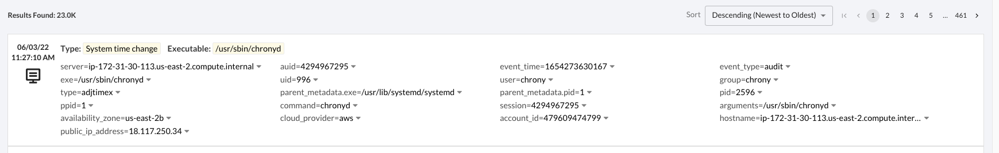
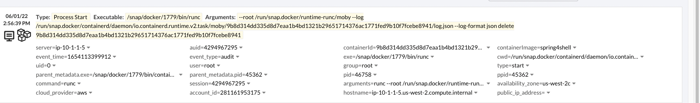

Threat Stack Advanced Usage Guide
==================================

Types of Events
---------------

Threat Stack Collects telemetry from a variety of sensors in the environment, outlined below. They are all stored in JSON format.

*Linux/Containers*

* FIM changes via inotify/FAnotify
* Agent collection of auditd socket
* Docker/Container Telemetry through the use of tscontainerd which utilizes docker APIs to augment existing audit messages referencing the original docker container

Sample Linux Host Event

Sample Linux Raw Event JSON

.. codeblock::

   {
  "agent_id": "65e341d1-c0d2-11ec-99e9-333bd87d55e3",
  "organization_id": "5fa075114135dd5944bb5faa",
  "_insert_time": 1654273633669,
  "_id": "06775bf6-e35a-11ec-a852-12888c50dde9",
  "timestamp": 1654273630167,
  "event_time": 1654273630167,
  "event_type": "audit",
  "args": [
    "/usr/sbin/chronyd"
  ],
  "arguments": "/usr/sbin/chronyd",
  "auid": 4294967295,
  "command": "chronyd",
  "exe": "/usr/sbin/chronyd",
  "exit": "0",
  "gid": 994,
  "group": "chrony",
  "header": {
    "id": 3162035,
    "milliseconds": 167,
    "timestamp": 1654273630,
    "sequenceId": 427161847792120600
  },
  "path": [],
  "pid": 2596,
  "ppid": 1,
  "session": 4294967295,
  "success": true,
  "syscall": "adjtimex",
  "type": "adjtimex",
  "uid": 996,
  "user": "chrony",
  "network_metadata": [
    {
      "private_dns_name": [
        "ip-172-31-30-113.us-east-2.compute.internal"
      ],
      "private_ip_address": [
        "172.31.30.113"
      ],
      "public_dns_name": [
        "ec2-18-117-250-34.us-east-2.compute.amazonaws.com"
      ],
      "public_ip_address": [
        "18.117.250.34"
      ],
      "subnet_id": "subnet-4888fa32",
      "vpc_id": "vpc-4f140827",
      "network_interface": "eni-0411c3f9c8220ed74"
    }
  ],
  "agent_metadata": {
    "agent_id": "5fa075114135dd5944bb5faa-65a9ba50-c0d2-11ec-a1c2-cf1b9557ec5a0001020304050607",
    "deployment_mode": "host",
    "version": "2.5.0"
  },
  "host_metadata": {
    "hostname": "ip-172-31-30-113.us-east-2.compute.internal",
    "kernel": "5.10.106-102.504.amzn2.x86_64",
    "os_version": "amzn-2",
    "image_id": "ami-0c7478fd229861c57",
    "instance_id": "i-0598d4c63db69fbe3",
    "instance_type": "t2.micro"
  },
  "provider_metadata": {
    "cloud_provider": "aws",
    "account_id": "479609474799",
    "availability_zone": "us-east-2b"
  },
  "alert_metadata": {
    "rule_matches": [],
    "match_state": "UNMATCHED",
    "num_matched": 0,
    "num_suppressed": 0
  },
  "parent_metadata": {
    "exe": "/usr/lib/systemd/systemd",
    "pid": 1,
    "timestamp": 1650476859000
  },
  "workloadMetadata": {
    "role": "jeffec2test"
  }
}

Sample Container Host Event

Sample Container Raw Event JSON

.. codeblock::
   
   
{
  "agent_id": "c4f00bc1-e064-11ec-8455-cdbb077e404d",
  "organization_id": "5fa075114135dd5944bb5faa",
  "_insert_time": 1654113404834,
  "_id": "f6a36904-e1e4-11ec-a7af-0e400620ee11",
  "timestamp": 1654113399912,
  "event_time": 1654113399912,
  "event_type": "audit",
  "args": [
    "runc",
    "--root",
    "/run/snap.docker/runtime-runc/moby",
    "--log",
    "/run/snap.docker/containerd/daemon/io.containerd.runtime.v2.task/moby/9b8d314dd335d8d7eaa1b4bd1321b29651714376ac1771fed9b10f7fcebe8941/log.json",
    "--log-format",
    "json",
    "delete",
    "9b8d314dd335d8d7eaa1b4bd1321b29651714376ac1771fed9b10f7fcebe8941"
  ],
  "arguments": "runc --root /run/snap.docker/runtime-runc/moby --log /run/snap.docker/containerd/daemon/io.containerd.runtime.v2.task/moby/9b8d314dd335d8d7eaa1b4bd1321b29651714376ac1771fed9b10f7fcebe8941/log.json --log-format json delete 9b8d314dd335d8d7eaa1b4bd1321b29651714376ac1771fed9b10f7fcebe8941",
  "auid": 4294967295,
  "command": "runc",
  "containerId": "9b8d314dd335d8d7eaa1b4bd1321b29651714376ac1771fed9b10f7fcebe8941",
  "containerImage": "spring4shell",
  "cwd": "/run/snap.docker/containerd/daemon/io.containerd.runtime.v2.task/moby/9b8d314dd335d8d7eaa1b4bd1321b29651714376ac1771fed9b10f7fcebe8941",
  "exe": "/snap/docker/1779/bin/runc",
  "exit": "0",
  "gid": 0,
  "group": "root",
  "header": {
    "id": 58877,
    "milliseconds": 912,
    "timestamp": 1654113399,
    "sequenceId": 424473629668277500
  },
  "path": [
    "/snap/docker/1779/bin/runc"
  ],
  "pid": 46758,
  "ppid": 45362,
  "session": 4294967295,
  "success": true,
  "syscall": "execve",
  "type": "start",
  "uid": 0,
  "user": "root",
  "network_metadata": [
    {
      "private_dns_name": [
        "ip-10-1-10-20.us-west-2.compute.internal"
      ],
      "private_ip_address": [
        "10.1.10.20"
      ],
      "public_dns_name": [],
      "public_ip_address": [],
      "subnet_id": "subnet-06890ec3a1f5c6112",
      "vpc_id": "vpc-0b5d1a3f28df054e8",
      "network_interface": "eni-042525704c0552f6f"
    },
    {
      "private_dns_name": [
        "ip-10-1-1-5.us-west-2.compute.internal"
      ],
      "private_ip_address": [
        "10.1.1.5"
      ],
      "public_dns_name": [],
      "public_ip_address": [],
      "subnet_id": "subnet-0d8a1dc5a059e1d5b",
      "vpc_id": "vpc-0b5d1a3f28df054e8",
      "network_interface": "eni-00ef2e25726dc1da7"
    }
  ],
  "agent_metadata": {
    "agent_id": "5fa075114135dd5944bb5faa-c4b09120-e064-11ec-83e2-9ff87d185fab0001020304050607",
    "deployment_mode": "host",
    "version": "3.0.0"
  },
  "host_metadata": {
    "hostname": "ip-10-1-1-5.us-west-2.compute.internal",
    "kernel": "5.4.0-1048-aws",
    "os_version": "ubuntu-20.04",
    "image_id": "ami-04715e594adfda535",
    "instance_id": "i-0d1de2545d1b6a425",
    "instance_type": "t3a.medium",
    "instance_arn": "arn:aws:iam::281161953175:instance-profile/deploymentInstanceRole",
    "server_name": "ip-10-1-1-5"
  },
  "provider_metadata": {
    "cloud_provider": "aws",
    "account_id": "281161953175",
    "availability_zone": "us-west-2c"
  },
  "alert_metadata": {
    "rule_matches": [],
    "match_state": "UNMATCHED",
    "num_matched": 0,
    "num_suppressed": 0
  },
  "parent_metadata": {
    "exe": "/snap/docker/1779/bin/containerd-shim-runc-v2",
    "pid": 45362,
    "timestamp": 1654113278943
  }
}

*Windows*

* FIM Changes by monitoring a file system driver loaded via the Win32 API HRESULT FilterLoad(LPCWSTR 1pFilterName). FilterLoad is the name of the filter driver, 'ThreatStackFIM'
* Windows events from windows native logging capabilities
* Sysmon Events should sysmon be configured(which is advised)

Sample Windows Host Event

.. image:: _static/SampleWinsec.png

Sample Windows Raw JSON

.. clodeblock::

   {
  "agent_id": "7dce3f57-e89d-11eb-aa4d-67d11ed42ec3",
  "organization_id": "59f215944b481eef05cfcbd4",
  "_insert_time": 1654272003712,
  "_id": "3aefa8cf-e356-11ec-88cd-120acde9a693",
  "timestamp": 1654272000531,
  "event_time": 1654272000531,
  "event_type": "winsec",
  "domain": "WORKGROUP",
  "exe": "C:\\Windows\\System32\\wsqmcons.exe",
  "pid": 47860,
  "record_number": 26017698,
  "session": 999,
  "status": "0x0",
  "_subtype": "Process Termination",
  "summary": "A process has exited.",
  "user": "EC2AMAZ-7NK3C9S$",
  "win_event_id": 4689,
  "sid": "S-1-5-18",
  "network_metadata": [
    {
      "private_dns_name": [
        "ip-172-31-73-196.ec2.internal"
      ],
      "private_ip_address": [
        "172.31.73.196"
      ],
      "public_dns_name": [
        "ec2-34-239-101-12.compute-1.amazonaws.com"
      ],
      "public_ip_address": [
        "34.239.101.12"
      ],
      "subnet_id": "subnet-30555f1d",
      "vpc_id": "vpc-e2f9d084",
      "network_interface": "eni-07f9af1edd551aac2"
    }
  ],
  "agent_metadata": {
    "agent_id": "59f215944b481eef05cfcbd4-7d6bac10-e89d-11eb-bdd8-5b3cd2f4c44ca613fd23a88993b3",
    "deployment_mode": "host",
    "version": "2.3.0w"
  },
  "host_metadata": {
    "hostname": "ip-172-31-73-196.ec2.internal",
    "kernel": "14393",
    "os_version": "Windows Server 2016 Datacenter 10.0.14393",
    "image_id": "ami-0d41aee8a57fdb850",
    "instance_id": "i-089226c60a0155d63",
    "instance_type": "t2.medium"
  },
  "provider_metadata": {
    "cloud_provider": "aws",
    "account_id": "634282195254",
    "availability_zone": "us-east-1a"
  },
  "alert_metadata": {
    "rule_matches": [],
    "match_state": "UNMATCHED",
    "num_matched": 0,
    "num_suppressed": 0
  },
  "workloadMetadata": {
    "env": "prod",
    "role": "prod.dc.1"
  },
  "containerLabels": {}
}

*Kubernetes*

* Kubernetes API telemetry
* Cloudtrail data supporting managed kubernetes (EKS Cloudtrail data) if applicable

*AWS Control Plane*

* AWS Cloudtrail Logs

All the above telemetry are referred to collectively as *events*. You can see all the raw events in an organization by navigating to the Threat Stack Console, and navigating to the 'events' section of the platform.

Lifecycle of an event and alert
-------------------------------

All the above telemetry is captured, and evaluated against our rules engine on our backend. The Logic is as follows.

1. Collect the event data from the sensor(s) in the organization environment.
2. Evaluate the filters against a rule logic.
3. If the event data matches parameters for a rule, while also not be suppressed against the alert will fire.

events are retained for 72 hours/3 days from collection, if the activity is collected as an alert, it will be retained for 1 calendar year. There is no way to delete an alert from the platform. If you dismiss it, it will move to the 'dismissed' tab 

.. note::

   It can take 10-15 minutes for a suppression update, as well as 10-15 minutes for new rules to kick in for our backend to update. In addition, while alerts are retained for 1 year, there is a 60k Alert UI cap. As a result, if you were to hypothetically aggregate 20k of alerts per day, you would only have 3 days of visibility at a time.

Lets look at an example in my personal organization below.

Investigating Root Cause of activity (linux)
--------------------------------------------

Investigating Root Cause of activity (windows)
----------------------------------------------

Investigating Root Cause of activity (cloudtrail)
-------------------------------------------------

Suppression Best Practices
--------------------------
When drafting suppressions, there is an inherent risk 

*Good Suppression Example*

.. codeblock::
  
   user = 'root' AND tty = null AND cwd = '/usr/bin' AND session = '4294967295' AND auid = '4294967295' AND 
   arguments = 'ps -e -o pid,ppid,state,command' AND exe = '/usr/sbin/chronyd'

  

*Bad Suppression Example that will not work, due the event_time, agent_id will only apply to that agent_id and PID being recycled*

.. codeblock::

  pid = '3081' AND user = 'root' AND agent_id = "abcdef-1234-4va1-ad42-555bd87fa32a" AND command = 'ps' AND event_time = '1654270691800'
  

*Bad Suppression Example that will work, but is too broad*

.. codeblock::

  user = 'root' AND command = 'ps' 
  
  
  
Suppression Best Practices:

.. note::

   I advise leveraging the following values when suppression linux events

   user = 'XXXX' AND tty = 'value' AND session = 'XXXXXXXX' AND arguments starts_with AND arguments like AND exe = 'value2'
