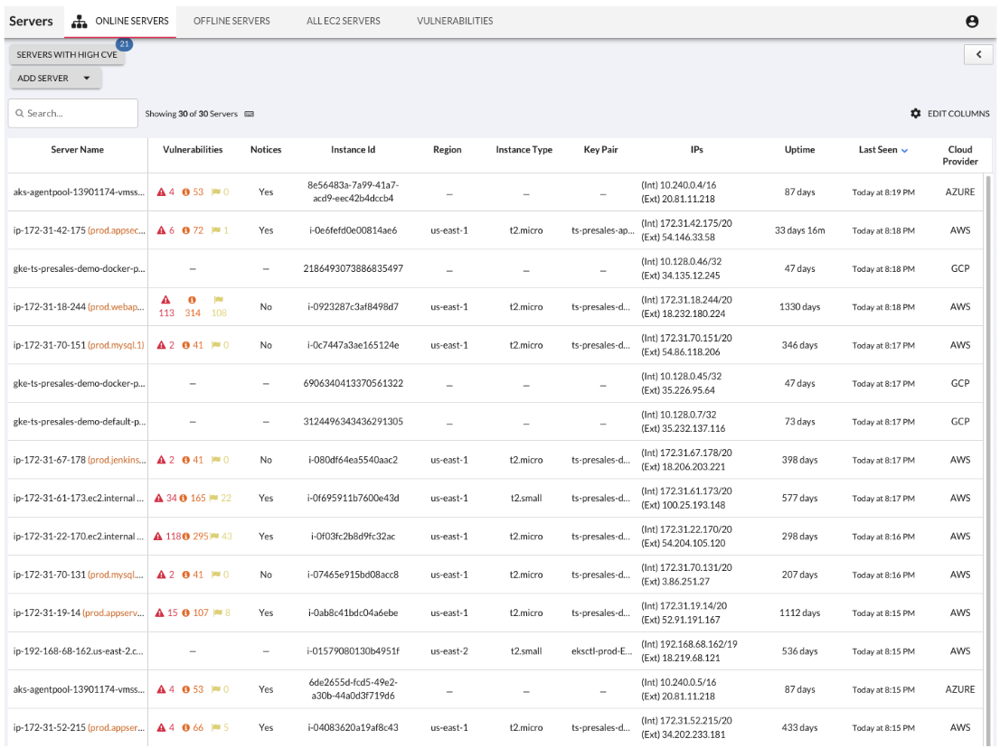
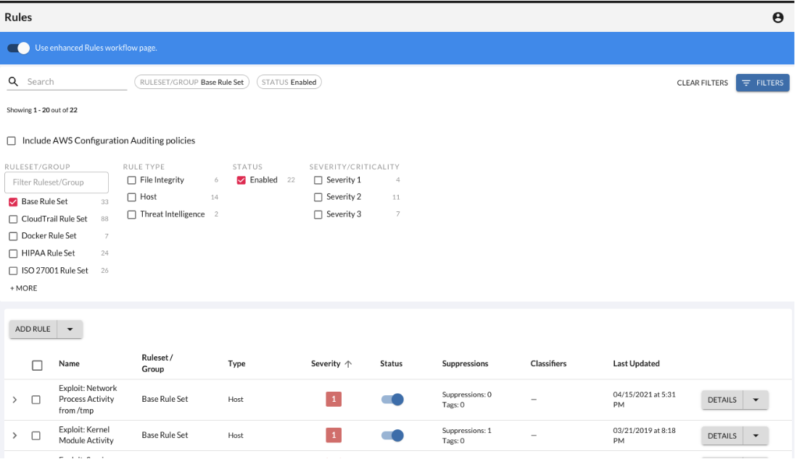
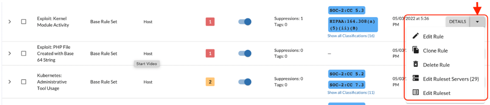

Threat Stack Cloud Security Platform
=====================================

.. image:: _static/Dashboard.png

Dashboard
----------

To access the Dashboard, Log into Threat Stack: https://app.threatstack.com/login 

In the Email field, type your account email address and click Next. 

For the lab enter, StudentN@Acme.com

In the Password field, type your account password and click Next. 

For the lab enter, XXXXXXXX

Monitoring
-----------
By Selecting, Servers Page, you can filter or change information shown about servers, deploy Agents, and view a list of vulnerabilities found on the servers protected by the Agent. 

For more information on other abilities navigate to our Servers Page Feature Walkthrough: https://threatstack.zendesk.com/hc/en-us/articles/360055728251-Servers-Page 

 
Vulnerabilities
----------------
Threat Stack Agent retrieves a list of installed packages on the host each day and matches against all known Common Vulnerabilities & Exposures (CVEs) captured in the National Vulnerability Database (NVD). It then compares them against the published security notice and triage data from the specific Linux distribution. 

https://threatstack.zendesk.com/hc/en-us/articles/115001295270-Vulnerability-Assessment-Feature-Overview 

.. code-block:: console

AWS EC2 Integration 
--------------------

With an Amazon Web Service (AWS) profile integration, the user can see exactly what instances are protected and which are not. The Threat Stack Cloud Security PlatformⓇ (CSP) will always reflect the current state of your infrastructure through continuous scans for instance creation or termination, etc.  

Detection
---------

By Selecting, Rules Page, you can review all the included pre-built rules that monitor common threats to any infrastructure. The Base Ruleset has been created by our rules council & SOC team to monitor for the most common attack vectors our experts see on a continuous basis. Due to the complexities of modern infrastructure, we also provide customers with the ability to create custom rules. This provides you with the ability to monitor for behaviors that matter to your unique infrastructure. 

Rules Details Overview
----------------------
Select the options button to view available configurations for the rule selected. 

