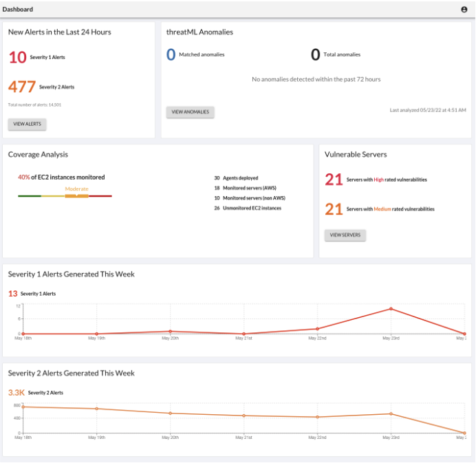

Threat Stack Cloud Security Platform
=====================================

Dashboard
----------

To access the Dashboard, Log into Threat Stack: https://app.threatstack.com/login 

In the Email field, type your account email address and click Next. 

For the lab enter, StudentN@Acme.com

In the Password field, type your account password and click Next. 

For the lab enter, XXXXXXXX

Monitoring
-----------
By Selecting, Servers Page, you can filter or change information shown about servers, deploy Agents, and view a list of vulnerabilities found on the servers protected by the Agent. 

.. image:: _static/Servers.png

For more information on other abilities navigate to our Servers Page Feature Walkthrough: https://threatstack.zendesk.com/hc/en-us/articles/360055728251-Servers-Page 

Page Break
 
Vulnerabilities
----------------

.. image:: _static/Vulnerabilities.png

.. code-block:: console

   

NOT A DUPE
----------------
